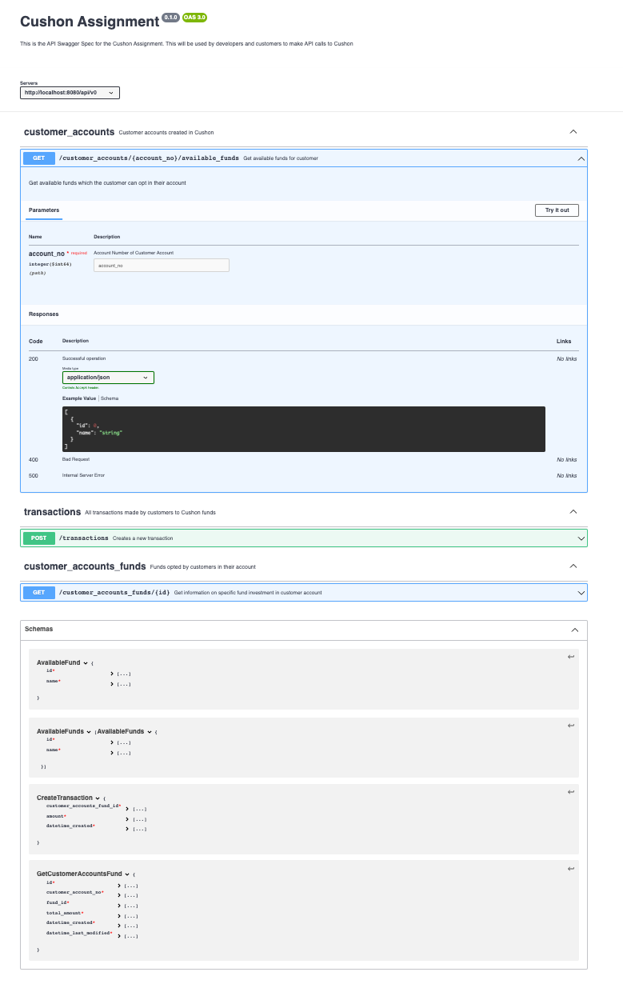

# API

## Content
- [Viewing the Swagger Spec](#viewing-the-swagger-spec)
- [Postman Collection](#postman-collection)

## Viewing the Swagger Spec
- You can copy the contents in the `swagger.yaml` to [swagger editor][swagger_editor_home]
- When you do so, you will see the spec in the following format:

## Postman Collection
- If you want to use the API via Postman, you can import the [Postman collection JSON file](api.postman_collection.json) to Postman
- Make sure that you are running the server and the db before sending requests. This information can be found [here](../README.md#usage)

[//]: # (Reference Links)
[swagger_editor_home]: <https://swagger.io/tools/swagger-editor/>