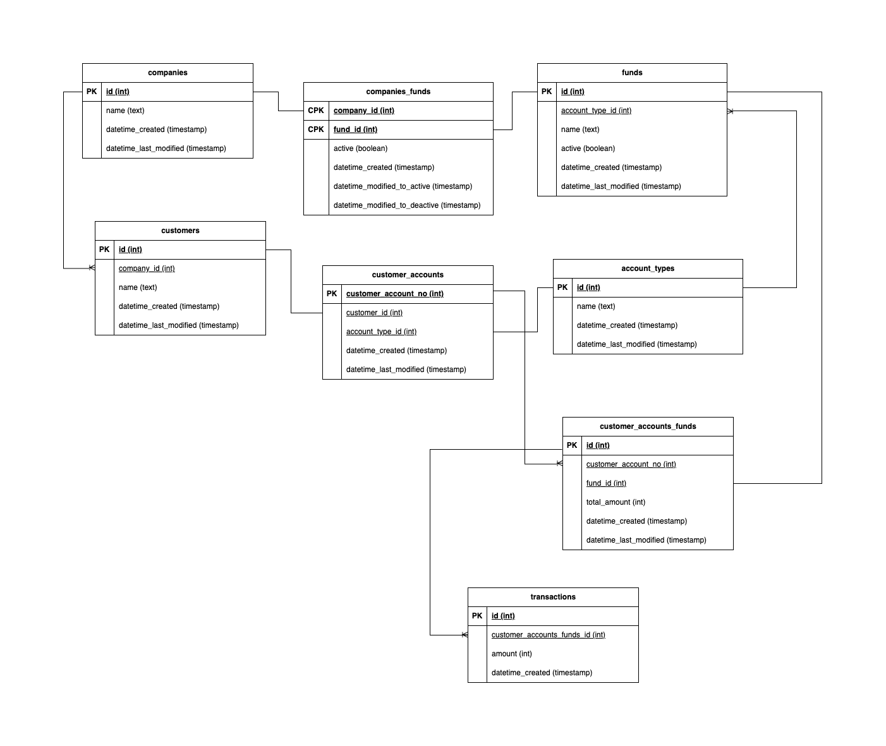

# Data
This document outlines the data entites in this assignment and how they relate to each other. These data entities will form the structure of database where the data will be stored.

[][class_diagram_drawio]

## Tables

### Companies
- The companies table contains all the companies who have an existing arrangement with Cushon to provide Cushon's financial services to their employees.
E.g. 
```
KFC, Heineken, Darwin, Amadeus, Retail (Direct)
```

### Account_Types
- The account_types table contains all the products and solutions (the different types of accounts) that Cushon provides to their users.
E.g. 
```
Cushon ISA, Net Zero Pension, Cushion LISA, Cushion JISA, Cushon GIA
```

### Funds
- The funds table contains all the funds associated to each account that Cushon provides.
E.g. 
```
Cushon ISA account provides Cushon Equities Fund
```

### Customers
- The customers table contains all the customers who are associated to Cushon. The customers can either be Employees of Companies (Employers) or Retail (direct) customers. 
- A customer is associated to a company
- To distinguish between employers and retail direct customers, the retail direct customers will be associated to the company 'Retail (Direct)' whereas employers will be associated to their own company. This gives separation between both types of customers and hence functionality of both types of customers can be separated based on this.
E.g.
```
Customer 1 is associated to the company 'Retail (Direct)' (a.k.a customer is a retail (direct) customer)
```

### Customer_Accounts
- The customer_accounts table contain all the accounts created in Cushon where each account is related to a customer and a specific account type
E.g.
```
Customer 1 has a Cushon ISA account
```

### Companies_Funds
- The companies_funds table contain all the funds which are available for the companies to use by Cushon and in turn available to the employers of those companies too. 
- Having this table allows more funds to be added for a company and its employers to use which will allow customers to select multiple fund options in the future. 
- The `active` field is available in the data so that data can be added beforehand to the database and when the data is ready to be shown, then the active boolean can be used to active it. This means that the restriction to selecting a single fund can be achieved for the time being (where that single fund is active whereas the other funds can be set to inactive until ready)
E.g.
```
Company `KFC` allows their employees to use the Cushon Equities Fund with their Cushon ISA account
```
- An alternative would have been companies_account_types which would contain the account types that are available for the company to use rather than the funds. But the main approach gives flexibility at a lower level (funds) where we can use the data to even limit at account_types if needs be.  

### Customer_Accounts_Funds
- The customer_account_funds table contain all the funds which the customer has chosen and made payment to in their specific account
E.g.
```
Customer 1 has opted for the Cushon Equities Fund in their Cushon ISA account
```
- The `total_amount` field is available in the data so that most commonly viewed data such as `total_amount` value can be retrieved quickly rather than having to tranverse through the transactions to calculate the total amount each time.

### Transactions
- The transactions table contain all the transactions that each customer has made to their customer account's fund. This means that the customer is able to view their entire transaction and details of their specific transactions
E.g.
```
Customer 1 made a transaction of £25000 to their Cushon Equities Fund in their Cushon ISA account
```

## Alternative Structure
- For complete separation, there can be companies_funds and retail_direct_funds where companies_funds will only be associated to funds which are available to the company whereas retail_direct_funds will only be associated to funds available to the retail (direct) customers.
- We can also split up customers into employers and retail_direct_customers where employers will hold information on employees of companies whereas retail_direct_customers will hold information on retail (direct) customers

## Decisions
- Currency is stored as an int type rather than float because using floats can produce unexpected results because it cannot be exactly stored inside our computer's internal memory registers, which use a form of binary notation to store each bit of the digit: this can only ever approximate most decimal fractions. Calculations using floating-point numbers, therefore, almost always have a very small margin of error, meaning that you can't rely on the results for absolute precision.

### Assumption
- The alternative structure wasn't chosen due to the assumption that the data structure (model) will be the same for both employers and retail (direct) customers. If this wasn't the case, the alternative structure will be more ideal. Furthermore, as the data model is assumed to be the same, the main approach utilises the use of the existing database structure without needing to create new tables specifically for retail (direct) customers. This allows us to use the existing logical functionalities (methods) in the backend to provide Cushon services to retail (direct) customers at a much faster time.
- The funds available to companies can vary and hence why the companies_funds table is created and this gives more flexibility on which funds are allowed.
- A customer can make multiple accounts in Cushon
- Currency is defaulted to GBP and is stored pennies

[//]: # (Reference Links)
[class_diagram_drawio]: <https://viewer.diagrams.net/?tags=%7B%7D&highlight=0000ff&edit=_blank&layers=1&nav=1&title=cushon_class_diagram.drawio#R7V1rd6I8tP41s9Y5H95Z3IWPgDdQVMQbfJmFgICAoKCIv%2F6EVqyjTqutrT0lXTNtCCGE5Ml%2Bkp2dnV84H2wbKz1ypNC0%2FF8YYm5%2F4dVfGIYxJAH%2B5DHZcwyKkshzjL1yzX3cS4Ti7qx9ZJFs7ZpW%2FFfCJAz9xI3%2BjjTCxcIykr%2Fi9NUqTP9ONgv9v98a6bZ1FqEYun8eO3bNxNnHUsWH5Tealms7xatRinm%2BM9UNz16F68X%2BhYtwYT3fCfQin%2F1Hxo5uhulRFF77hfOrMEyeQ8GWt%2Fy8YosqGwvZ2G97VEOU46U%2B5FqDzui%2F58zqtzxy%2BLqVtUjenXXkip0Rvh1h7obkJ63hakN19o8gG91f76vSCINIX7igNZ8%2FOsmKSgbfH%2BXBRJ%2FmUVyc6KtkjwUcARGgdRPdXVgrEIE%2BXfu%2BHsXuU%2FLnGMf1zbaeheukyKi44mbu1jL7z1DI0wJUtEFm%2BWWe%2BQxkruwLk9%2FWfddegLAB6iR%2FI7eyYlCWth4n%2BxROEvj74JUVuK%2FojbVKrO0RsvYV2rDCwEpWGUhSdJ2in%2Bw7Dr2%2FTF9AiFX2cc4x%2Forn9D3w7UPWLy0IAvtGvKFB0bMGfb0d%2BzmiOSdcubu89fx9bR%2B37dN16ga%2BvgCdSDdPorjwSWw8tZHr%2B3zohzkAnjrSKQbyROYqjAb6yraSfUQUuovkqR5IDvwDNcMjv8lfJCgrD67Rl2vwL0%2B%2BSvhwEScrgLU8Dws0eWrlzc4lYbTP1LdmRf6rfb3n4WmYJGHwT1S82kfeRsUeBfiVKMA%2FCwTYGQh6rX%2FCAHx%2F4up%2BH8hlfWH7z432JKb1l0a70LIX6%2FpQv6cVf9p9Q1CdM%2F9JnDquaVqgK3Op4yaWEulGnigFVPVWJ361B7zdXEftg9%2FYPPvMXirt5tx0H4ithZ6A%2FgPIJz5r80M53w8D%2FAwGIDmG%2FA%2FoNv%2F7YDgU0vs5LReDRncXdvv5SeoEL%2BQ3wcv2392buCt%2BrsruCwBEQDK5ikyQTyQT6tFkQl4Pgq%2BRHZbpFvl9LpMQV7fVT2cS6gwDCz3Ii%2Fo%2FoGa%2BP5l8B4iUjjyKGTZkjweyB%2FNo9iheVkL6OHQAyB%2BVc7WECV6YuIH1x1hZIPg0McmvQXcPohIzyg2oKR2l0OeKDUgpX00pKPZoTqHPFRtl4ZRDD4CcQp9rJw6c4oNO8ycITXfmQmZ5B3ZKxyzouUiZHd4FF8FeRQlTCP9%2FL4LhyIVmPqwe338RDCou774KdughH1kGu4iDTxsnoOeqyzKtg0H15aEqzvWXcCXsQ4h5ZYBw61TgjQHCNdl9BYTg3PNKTrlh7nk7p1xYDftiTinx5BOFs8%2Bjurg0xqT8vK%2BsQcDOA7phgAIkf5Issv4cM85zOvDiQ9LvzkLfA1Xlo50KZJ3Hs86FVbSvZp3ykk7l6tb68ZxzvqIOzTBuBUn5KAS%2FwYILcshnccilZbMvJhH8XA1SGhY5dAJIIyh%2BPqjUjcTdPDHJNAx9S1%2BUmUxuwErp2ISGZPIdyIR8NJnQ5eUSGlLJoSrOmQTa9X0YNeUjlRvUG5BUPo1UrjXc%2BDxSuWHLwE8jFfrq5vrppFJoW6Fh3%2F2xUzpqwc%2BpxVjHoAmtFTTuuwIp2IlxH34tdA5scneWwOHGsrtb9%2BHXi5Dv4uSCOKeJEln3HToBHC8Q55vLoHXfhxBTOvN%2FAoOUcu8J6O2U8nBXF0R5bfsOPQDyCXGFZd%2Bzl7wMGvV9HE7lIxu4hPYNyObhnjGI8q6gEXAF7VAV5yto0KbvVpCUjkIY6Ob1G1DI4z1hMDfMW38YhzDXq7J%2FOocw59NWaIXxYdSUj1Sg14TvQCoXTPu%2BmFTK6%2FGVgT4TDlVxPj2FVhh3wk7pqIU8n68czhn5Ax0tXYkXqjDGOxzTc6XB3queli4gaP8%2B8uR0ExQ5fx%2F6XRB2w0yo1IOXGyQaeT1Cv4vLJ%2FJ8KsSXyCrk0AtuGr%2Fcl3O%2Bi0A4n81cWrT73qOVr7MOuQE527%2Fb%2BXi4Qd139HJNdl%2BxYRKDFoffgFwe7%2FupyLmk7PLSDyC9oPj5lCafyEBy%2BSBwyscuOJy63F3veju7PN7HE15e68OXPgCZBcXPZy7QPcf7sFI6MiGhbeE34JLH%2B3oiy2tcSL7LuPBHUgkJ3XN8AmrKRyrQPcd3IJWH%2B3wiy%2Bueg3yXe44fSSqFULpEKoVNyJ8k%2FPMyZ4H8chOASscv6AUnHZBgvp5gHu7%2FCb3FtccPYxj0BlPRn04x6AXfHhc5xrQgy7wXROWjmQuHPBa%2BoP7sj2qB1ohXAwdFCqvCYn3%2BEpQuWa5%2F4sGP8OTHK0cStwiVuxz9%2BLV7GNCSn%2F0ID388qgt4%2BuO9MVO6DQwoPIjrSmK5YYr6DmJ5uIsotMxHccGzuI7q4pKq4tRL1Mns4s8i%2FAXdRX0QWeXjnsKaAHLPQ7nn4R6jUOwGty8%2FjXsOnQByD1o0%2B2vcc2aMDvnmfWgqH99cMBuCfPP1fPN491LoLZY%2FP41wSDjZeamL88lOEoKO%2FkcP8nlNTjKmZbiB7n97hdr3QEz5SAW7YXcLJJXPI5WHu5dCsRvW6H4aqWDXN9iPJxXsfIkOWqd%2FHDclpJYbNrtAavk8arlgP%2FjV1HLDzPXHUQt1dYP9fGo5n7dC54X3Qk%2F5CObCCWNAEC%2Fi3PgUCOXXyeYXtBYEd%2Bhi5b5YTLngu%2FDyOZLkp7EFPPXrynHDLYKEuB4a38ZY8MK5X2UyFoRnfx3VxblyAhoLfgwzJRwvQC8c95%2BQ3k4sjzcWLPEZXyg85OuoLi7pJd4wFtxvRYI2HHcAWPko6MIufUhBX09Bj7cZpEpsM3joBJCCUOpc2QGNN96HlfKxyYXzWyCbfD2bfAeLwBt0pj%2BNTm5wqfLj6eTCQSvQeOPjuCkftVDnKpJit1ySRRZcXLsCLkxxZGOxonKtM%2FNPXFyj4CaC%2By%2BuUdev0n%2BXE7lQ6twWo0yLaxTcRvBSF%2BfbCODi2scw88qA4daJwRsDhmuy%2BwoQFeWAxHLHuejtxPL407gqJdZsHjoBZBW0cq6SWOjBs09Ia%2Fv9ieV7wKSERAK3DXwHInn8wVuVEu8aqMBdAy918cquAajTfDduSsgs8Lzg78Asjz%2BG67AlrpTU8q7Tgn8mtdDnc1W4Ie1e6CkfwdDnBuZn5qOvM84vuHAG7lBF4%2B0Zg0CuxNBBsH8CZcBp6f0XzujrbYW%2Fza40%2BnxaWqaFMxrOTF%2Fq4nxm%2Bqpv4e89avjClbQbQFQ60xsMgYel3H%2BaejvTPHybGobcsF%2Fxh81SXzoBpBkMuTT0%2FNc2Nbgv7eOIKh3noDRUjX4Hznn8vrSiBCXknJdOADkHZS5Z8ZxwzrFBOOSdO6CqfLzDQJcc34F3vsEONqbEPjkY6JPjpS7O1avQ2uPjuCkhtdxwSAakls%2Bjlsd7tmdumNz%2BOGq5%2FuT5n04tGHI%2Bt4XWHvdCT%2BkIBiukyGtixVqY7Gr11Db7xj9qhVVeNqsgEdAUq2xyfKHmF7%2FJ4rK6Pb5ZLZjG2rrJZJ9jHj56Cly9PJRfFM%2Bct%2F9rhhtxuF4Z1ms4eU6XFFT2r3SFlwrLtK1XwbSyfD1xN8eJXoVKL%2BfNFxAetFh7DiKxE3g8f9H%2BqRdonGWEk29k9PzJZxmBNtezo2R7Xv9ngckTN8zFIRz%2FKtdZevKv9CDwXII7A%2F6Ks4JKAniMuRLyxentEPIn72FObLyKoeW%2FynWWHvsKyOPnQ4YzyNsA1tFtADvjUwz5e%2BQA4pBXeRYFY%2BjfyNEPdiIQznkYRZjfzNFPsb%2FmmEexYoB%2F%2F9XsC%2BcKfUh6vEMKHCQOepvEuXK4dEDL2%2FKj2Er%2Btvygr%2BXMo5YmL4yQirgPyhnqMoayAj7vlDoo%2Bnq%2Bp%2BO7Owmhf3WJ7O%2Fe8M9Sv%2F74l3DyDXNbN9BzDHG59HEN3W%2FrU8vvhbGbH5cB7hdTEM7Pb3C64dlPfa6YvpjWTF8%2FLe0UObD7ucnTjIbT4whIMHD5ZHMMIp5eyBaxSBGTZ6Un%2Bi%2Bcfb7E6tHC%2FoXx7ojr9lOk1bBDFvx0lKFTG9og1JbAr2qdZ9U8fjalpQ34y40CvyqjnCgjkj1sihst8GNNZtmGOEK9NtpOUXa4HTJLGRm2uotBSHC8M7O3o4hfqImFypxgyj2Ux0UBi7yW3hN5gWrt7PG2Vk%2BR9rLtZUS3uiZcN%2BwKLtEB5bQ7Tl2pZJuRKS3xeAaap16db4y2bwisMpKUWAobYmWwasjeVp%2F4y4nA46EjeNOZTK3W8TJzd3W2hjOROZ%2FEwqQBnm%2F%2Bwjg9iwh5s82qiMhrm144m3fw9Xw2q89QX95ORJAMs5tJVyPSOm%2F7jsZsnYUey8Y4jAin0tNIu9cdR0lvTAakGlUId%2BGwbSr2ifnGjTpTJ9iiRmxOkdUWJxi%2FWV0Avqr7yhwTuL5sCwiyoRF6jRsrfyhPqpyTxakna02372XjRqpyXC8l9C6vKOKQdD1%2F4zMzhk7oVoQKPanBdGR%2BwMTN3coCopKr9WxRpvLlPxe3K%2BIymm%2Bi3UCv9U1%2F5o3E9bw75Gh6g09qCp%2Fxu%2F5qs2EsAOM6HkgGEEh1jq8kAwrkNFSb8%2B6ETvt5s4%2BCkaqMtc5AZpf5NQ8Q4GAey%2BUXbC3%2FpbPPP1UvVFkuzTEi5L9qISscpeN3ISsdXVfrz8H6QEZ8MQ8OsU6mjUdrA3M2ZmsUt1oEiG2O9VFfNetOZ1CN5lMMWavj%2FkYNhmurgab7d9NWNSKmEy7RJn1HaDrJtEHuugubEYK6N8VEvxuA6wD1zUZtI7gc0V04idHsr3qKqA5GrC1jTKYpLNaes2uJF0A18C5rC9VtpjVUauj1Gy%2B5ip42R1y92UeMarhp4yZuZiQuZeTGCIyNNPDIrkKnkktnkovmzycG7q%2FNRp1oj8mdkB1y51%2Fe0G%2BMdiouRqBM0RQjbCPoB92g7k7xEdJTBPeQvvhflCYYEfpYBd%2FpIGaTpdoZszYy0tEajKspZF5fG23iRJpLb8G3bYQ50TrOp9d4ep4aNnxCG2%2B1fsNPNFBKfcyse%2FMa2dmlz8%2FPI1mfOP607tf0MepPF528nMdf8vw1vtXwg67PRVZjFI9r4GueWtTfTOfEtrPz6Db21xvVv95oh8dfSe%2FfPDKwUQZaKMnzMqvkANSU%2F%2FRMg0F6PLN%2F52inTcTqFEPz%2FJCjvOg2nrdZVNMmnbkR%2BKnZeCrPU02A5w9tDJ4BaW0qRxZ4F6IOiFZ9lrYdOUd%2BXezX6kOLbSZAkm2xnT3sK4tePRBxwR8Gy11rxYmWXUsyTg2inUSKUmrzAp52u1q0XdT6NKitRXPDjyfxQMNnzMzDaKHBq2m3ngZSZQHu1%2FsuSMRmSDWsNdl4TtuChPu2ZwM65SYI1QM3qwA%2FdaLLd%2Fpya5Ll8ePOXJwOclhZ03Rg4Uz%2BInxM4Io1zdOyAqen%2FcAd5vG5RRaHeTOvWXMpRAm4jroZt3e8yE21KTvdtlbGWB7z42jHNVN%2FtO4Jba491Gy3pix3jQ3IkJtKJgOoox6HW9KY0ZuMI%2BUhC8AyV%2Bq4pRNUSAcjFGnwCS%2F0tFyQdlJDmtMDYoJs2aXnjeLnXFW7ryjUruGNPG%2FZ8URSFNW50t0pdX5XM%2Bwk7kdNLWrYomvKSiCg8zh15SHaCNuDmu5kWl9tUcGQTVxzSEhhXOtoETtVF6NutdXmqmNV5mNlide9uh0sO0RzLNan84xPFbROiwm%2F3DY8M%2FB0fl0LHFOdj7t5LYDSDpusG%2FeXTdGv25tlz66ORXRgZ27aR2N3uQ03PVAJaS7MdbmL9VJ%2BtwUXorFWN4w8qyEuuOQ6W2ydi9dkq8vrsar4FpNMrDap4ZWuxvBtcI9OZVdtLttCtZ5TA2sgs9TbODOiN9e8zXLWz1vUYkC9q17d87pLigG1FT6Hs7nSKsLLuaIXYXcO0j%2BFq51ZXxxpSP7FnBsrPUJv7ASaHrS3VQIUyWsGQER0Jp5pm%2FyuBYZR3EDegi8HAUnhd03KWMYkS1SrceaA8tWWkrMWiR07N7YZ3m6tZYtLADdUGm3aX4o1ijeG7aDDZXPTa7qtRrZySY6sD7Ec0sqgm251jcY5E%2BdAQ1Rq3pqYS9mIX0%2BJQY3Ctsrc5XZKFPWsrLmtkVVpStZIFmO9nV0dqUjiMWHV66ZjcTZc%2BIE6k%2Fip7Roy6MRTjSVtRPYmdnXDbtvewONbjtiU%2BXXKiV5V4DtbtpW2hmRTY3ehYiHcUmXDrIuIrGpbBhdasqXUhmKdYtU1q0hgsMnVHamPS2zekm68m4VKYytPpMnYIXXN7VuS1E4jpe73g3Z1O4%2F0JhIFYlNXEakp16rC3JCtwHIyRyeDPiZ12flSQ1oDSTGxfpjWG5TnBCJLtjdGI5xIbmfrYFqjKQXIrmYb3mTeVJBday7JZqOycPSW5vXXQkeRc9ihAsimmrGuHHSxNgiLqU2oDUyvi4HIVYRU6DenQ1CaGqVWBG7aUWogUyachOp8RE5Isxp1HFpy0kozm%2BIe3VzOyE7W2Ji2M%2FRnPt1bmdV0JQ3Enlobjev6SPNWi%2BqM8j3bmOsVVQ4GoBjcYKgASKStMBzXQcV7VXc0YzvNVAs0EM%2FLlrAQhKklbHqzWKyqXnu4Wln58GKFMpPtypbYkVSbeFtUqUiywXGsZhuGE6R9uaFNLbOR2CmbdXPkpJoQs1KyabkYYXJiVWNVwxmnioyNNMvsxrYtARHL7jQhrD4lG6cGpzWnIJk9ZscK5vdnZte27TiVunJFFYR2N9l052NZ5rXmhFVjb8gGY9zvT40ukLmxDZK15bYw5ePNejGU5YbabApaXBtyINmiv1IlVppvbKmhtFNpg1oRSvfWOvjsjblb6aAf1WeDLT1rooQxq9vbbS74o5G4C8CdrjrJ60%2Fb8L1ebyMm%2Bfi226PVWXOBM5hCcqa3WRjs0mIirLc2noQnr3kuw0oTVhz3MUcYDKtzu1N1G7t%2B5ggVuRHZij%2FSTG0SymhKN0JuOUXSkZYMR9aUxHB8l2BWPDPj3lLfkNRqux1pixE2227sjEf1OjfnB7ITk1FTB7J263ChEqgm2wLSz4n4sBZopsw%2FydAq0QAXKufVQ2%2FJE7wYDMasxuliy2lztZ24YiU7GTpyJQ1Uv%2B415cayH0pEbSCtY16s66KkryeGW4TjiREU4eUECJt9OJwY%2B%2FS95Vqm3SIcy3RQhJcyvSzCoUzv0ze2E61daVepxUbl5nRd9Cay11tyit1og%2FoSMsUzYy4yWFfrDUVOBwPE6nDLkSEre9WQHYXjKONSrql785AbqQAyU4HvodzC1nxX3LFLR1jInGu7mNyV67Wp2hwKfmMhLKRGxXNNVl81fYAgVvEx3m83vTCZOvR2iwviWJgM5dV6LmZc1mkvUmcYGjseDbgd30BqMVqnPNleVDSOdA1bNGnXHIF5q5iNNaa%2FVjisXjEMUGiKizpEPQIytxkFOG2ss8ZyMQcfv2u2DXdJslS1Kj1J60YurXNambLzOBdjCzFQnWQQN0Df2OkTYbjUzLlsaX7b1dfCZjQfAIrOpJ7XpXKE9naa11kuNkbSnSsEGN6ilLqZL5eo5MRjP8FpqiMCIlg3KyGohdFS65L8qMJUGZ5ApU1CIp1xPFmOGuSSQKqDRJqiQCqi83y8YlBYezNZgJk6ZyR1bLAe5sMbQkaDEfi73qx4cjEX1vnsxB%2BNI2vQxivYFOF1FLxx1x%2BqINUOEVbDrJp1PTLpYSsQbqcksakBOQjKwlV627G8mHroUqsR48rUniaKgEohyHKl9loDlFT1QOs0s1BHwbgwwKUkH1UMMzFNlLk6tkeiIlS6wrAiDTIeQaXA6nlcTNdo2%2B%2FkQ626l%2FdiRpJbUTScBmpS34a7Ib%2FUB9Zkysz03czp2v1lTZz7vQjtptNZkPUzac6OSd7IBTkoGGnu2nETQexRI%2FLm3rST%2BkJt1gJ15rfE567PNakBuIkLmF5F7ME46uqVhj4eEM2KyE8zZjPEJhk2cTMtNdr99VjcVHMhu1hWxEFrIoJ6rTOxU2fJYBtiUxthx%2FJ6oO0qmgIkZmchx4t6xMaOEczneIaobDDtOprVUziRJzvN5tonEFYKzGpG6z6vcDvdahvtbcxpEtXwQ7RdQ6oBEivkZKfys5Qn3HxcyIgNe1jJdQgsJ%2FaHZG3liUD%2B5nqR%2FB%2B3ChN9r%2F148gpxu67v%2BqXR%2F7DfWAWv4FSFJAgcwzGEsv4rznM%2B0t4xvxHmXH%2BHvrJg%2BjHFLH7Fss5DdNwYdlnl%2F5aq8zOV2FdYKb5DiY18aCnr9Wa9dvX201eo%2Fm5MrML8JlC0QhEVhKRpjLhRcXxdNh%2FUE9%2F21n%2Bu1l7z5Z%2B8jnWDU06oJoZqYqgmhmpiqCaGamKoJoZqYqgmhmpiqCaGamKoJoZqYqgmhmricquJ36OCu15HTCC%2FC88LB20R%2FpvGcBJj9jqjx%2BuLr%2FBP9lWGvDduHbhNg%2F2m5hS%2FdhfAwfnQZytZqRMtK155p0FupfJGRvfa%2BUKfvueNnS8n6YnKV1jZEp%2B08%2BVGO%2FRvsfMFuRLzV%2B98%2BRrDdeZ0X8vpGZtXm6ojyElOyCcZpxMn618V4g1z9NMHvmaPDHFnPvh%2FvC2MvpYQDhtAPpsQmFOwvndfGIpQb%2BR0r41hldPu9cbGsJP0BP4loL%2FCu8RDFs3pkwanivHkkZilLohZrMDu%2FQeMxBV7VB5SV6ecQBRby%2F%2Bqq4vD67OdTnccX3%2FORrlbbAw%2Be6NcgYjPln7k3%2FuzmJPtXRXiN0aTFcCbT7%2Fx90nG%2F4iTt9D3lYuvlva0UJ8s9W7wDgnNCKAZATQjgGYE0IwAmhFAMwJoRgDNCKAZATQjgGYE0IwAmhFAMwJoRgDNCG7Vll1vRkAiFzVShSaJon%2B%2F6JHAb%2BpM68n8RujjDKhzDeiJ0qtI8gnq43OP4FDpBJVOUOkElU5Q6QSVTlDpBJVOUOkElU5Q6QSVTlDpBJVOUOkElU5Q6XSD0ukmG7t%2F2x2SZ1tXmEquI6JIhCQrFIYUnswfuHWFuLP7nsJM7r%2FcFz%2Fxt61c5S175fyqZ61c8G3W6vsYMR%2F0bW8bMX%2FV4RYV4m87TZpEfyMVGqEoBiUIhj7J8FrDvVPb6DeyvZN986mBLvOGk%2Fl%2FGfS%2B09Ivl8lhmBwnX%2BmRI4Wmlaf4Pw%3D%3D>
[currency_go_int_float]: <https://golangprojectstructure.com/representing-money-and-currency-go-code/>