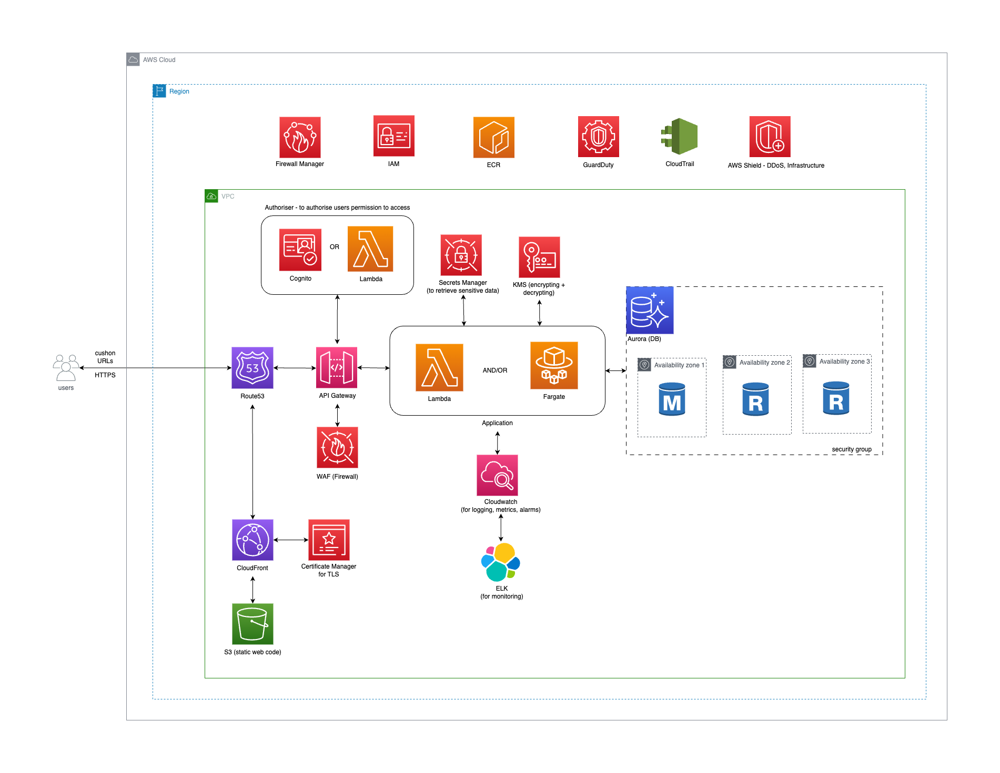

# Infrastructure
This document outlines the infrastructure required to run the application. This was created to have a visual understanding of how scability, security, high performance, resilience, extendability and maintenance can be achieved for the application. 

[][infra_diagram_drawio]

## Assumptions
- The cloud provider used in Cushon is AWS
- There is already an existing CI/CD pipeline to deploy code to the environments (dev, staging, prod)
- Any deployments are automatically tagged with a version

## Enhancements
- [Disaster Recovery Plan][aws_disaster_recovery] should be planned in the event when a natural disaster occurs in a region or availability zone

[//]: # (Reference Links)
[aws_disaster_recovery]: <https://docs.aws.amazon.com/whitepapers/latest/disaster-recovery-workloads-on-aws/disaster-recovery-options-in-the-cloud.html>
[aws_security]: <https://docs.aws.amazon.com/waf/latest/developerguide/what-is-aws-waf.html>
[aws_rds_or_aurora]: <https://aws.amazon.com/blogs/database/is-amazon-rds-for-postgresql-or-amazon-aurora-postgresql-a-better-choice-for-me/>
[infra_diagram_drawio]: <https://viewer.diagrams.net/?tags=%7B%7D&highlight=0000ff&edit=_blank&layers=1&nav=1&title=cloud_infra.drawio#R7V1bk5s4Fv41qco%2BxCVxEzza7nYmu8lOVzqzs7MvLtrIbirYuAD3ZX79SoAwSLItHIOhG08mMQKDOLfv6Ojo6IM%2BXb98jtzt47fQw8EHDXgvH%2FSbD5qmOaZB%2FqEtr1kLhCbIWlaR7%2BVt%2B4Z7%2F2%2BcN7LLdr6H48qFSRgGib%2BtNi7CzQYvkkqbG0Xhc%2FWyZRhUn7p1V1houF%2B4gdj6p%2B8lj%2FmL6bq1P%2FEb9leP7NEWe%2BW1y67OXyV%2BdL3wudSk337Qp1EYJtm39csUB5R8jDDZ72YHzhY9i%2FAmUflB9ISd2eTW3tz%2B%2FvsfALn%2F%2FN%2Fd7JOW3eXJDXb5G%2BedTV4ZCfDGG1NKkqNF4Maxv%2FigT%2BLEjRKx%2BTFZB6QBkq9RuNt4mD4bkCPSx%2Bj1v%2BWDv%2BjByGSHNy%2Flkzev5aM7HPlrnOAobxTfPCdGHO6iBT7yukbONtL7FU6OXKhn12GvIh45YT%2FjkHQneiUXPO%2BFgkn2Y0kcWFuEAzfxn6pC5eayuSpuVzzhLvTJq2kgVyRTcwil0h%2FlimTZzgggaGi2mf6NqrfMCJHfpSwT%2FI0dyY2rt8pIJdyKfCkRYt%2BUCl0NATRPC%2BCKiNL2IM%2BfcJTgF5kxcB%2FYHYCcefmvLAQqJEBMY0vMRY7IXAg4UpUZWaFTXaLop4kS%2F8TJ4jFXiC3lTtoJc0L%2BkO5Ps%2F9NcumUtow0U9Ioa0NiIxQvI%2F9A2RP4RlkbEhuheBk9Yr2uNsrakCn2mP81lPwacr8mf%2FRJuEsCf4OnBaZQGi%2FDTTINgzBK6a%2BT%2F2aUo5NV5Ho%2BrpxzDPNmppXO3fgRuZEfbsj5TRhRoZos%2FSAo%2FcYc62BippY1Cn%2Fi0pll%2BiFnPDd%2BLAwqFXuf4NRX9wEHd2Hs57d%2FCJMkXJcuGAf%2Bip5Iwi1pdfOjBekVtadli03fMEdgqLHjXOLoI914m5Fj6b%2FQfkwIom3pyfXLisL%2FyH2OjVGEM%2BPzZUH7MyGH2TfuKkJjPDd1qTU%2Faih4dT9qk2Vqi5rSWkPQ2u%2F0LU1dUF7yBkmV9lWub8IN5kQkbxL4x7N57Xsefczk%2BdFP8P3WTfHwmVBewOSLEz4%2Fy0MKI3iJL5YEK3XQEF%2Bs1n2cvVvzV37lUR%2FnxU9KPyNHf5XO7H9ED8q%2FuZxbhBS9IqNTXhHSASdpEBj2eY4QwXzuXrbRriPkdMERghUSOIboCBVOT8UTQpz%2FeTHdRYMnNHhCb9oTWgThzltGIdVmVUh2Dmi8qNmFYbTFIY0t8Y3shvQYwtOK%2FM5BmIW8TqKw3S0UFvw9qIEzURiakIdhR%2Bfu1TAMQ4Wxd9s4vCdoGYh1CU8hT%2FnLKTAYkLjPSGyBsa6jekisIQSh9W6QOK4RjSjMRL1wRKuQK8b270mvwUcCqYQLtGf4ITVOHv6HoMu9ClHU4EZ%2B9pMG%2BSiFxMQy%2B91KmAKK8aOGXKTc1YFlR6dwe9pwdbo1u4IsIWJlFi11XRhbCEogi5OYpj0YhTHzG5EjaHZKkKCBhCiSCc6TI0e4VetyZJ%2BWo71AwAP2vCQ96h7z4dCyQBXLFmNUBijUtxqlasp0ax2YxZQYHsk8pi1BtAYHDQp0GQYN3R00zGbGzJ7UGzRMplA338%2Bgwd3685Wb4Gf3Vd1fLexFh0cP4qzZ%2BO4Laficv2yvBww1GHB4eCCzpY2NDjSFWcymIQYChiiMKGzMUqKKIwtLaY2RZQhL9RthkH0LjHoIcwPMKUTvBmECd%2F3guTVsm3VA34%2BCi0xtnca0VgxNfc3est%2Book75%2FKzBz3aoeezNoYxC7KBxlNHYlE%2BBMiJVWkYZhdnLAWUGlOkxyizdiA5jahg7dEDhOwQz4lzuLH%2FNfuOMOum7ijMKscXrxajPXKtyEBNPx7FzcpxM%2FbDyzJ83GPCG%2BtVnTpi4dzZJ6aCEnV7PBDslODaRG4tz8ozz5MYWpwR4s9W02Ch4h21PlCCtSl4DiRZf7kTz%2Bnu5RU3ioG%2B8Sx7DyI8JbmrgE5XjkD6ZtZLvO3IupsTA0donakUcF3bVYoHjuDdAXp%2BDgjk0JOnY7cK23oHkONsR6CLxZqSizaajLk8XhdSNYXw4jA97PD6sG4XUz0qQs60Rm5opa26p%2BfK6K85Rv4VYZA36Hxgjloh%2BYpio2alCNsMecd7r9%2B%2B9YU1t1CfDJ44NJhSZIEv9bg70hzVY%2FQY300CGUw%2FcpgjqcPZuwG0RrjY%2BGVVcxnG3RAdVYkclKmw3psJiuG2av%2FKbtaQiG0ykBmeNWVJDxLJ8fHvMnEr1n9dzxpaqWTANc2IZKjwkF9vIgY7VG80mnd%2BR13Jpf%2BYZGXPowdHtE84QCF5AkHQmDyxSpReekmKw7PKCpLBYvFMp3h0p%2F6Rc5yBnXEeipXSBguHsP3zRg3OrP0FLsJE2X9Oo6fJPYux0sYsf0zDfH9%2B%2FvuH4ns6xEWliLh1q0883FZK1ezr7wWrydUSfIfmMTASKj1aRBIv3A5X1Ob1v9V58TkzT%2BtxasR3pen14HJkOCB5oF4WgahFCo1vLm2wLFXEeBhfamSv9Hc0R79Uy9HQg180W6h3YSBNgAEJHGhZtbuGOoYAFQ8xniPl0cmSoFvN5dpfq0XSzdsbVfn35tVbwmLLJWiug3vNDRL6t6Lc%2FxzNyyccZEY9nNwh6XgegPpsg54Mr297m3PAOFIKDQIfFW7PoGbBE4pgSgYZ8Js%2FlUGmYZh9Q6W2jUowXEU7i%2BdrduKu0I6qmT70mHAtAiPrcLj6J2nyfvT1p%2FJa%2FvwBYH9PkL3JV5OMnmiEW4w1lcvrdcxO37xBWu7afLcaNpHa5McSSTC7RmoaztKZhX5hRO35XRGmKrS00UaHarXOsXd9zsAFHlaIib8WnkmbnaU25DcMa4cFteNtuw4L2bkn6l2DmOsxrVLMrLIf6uOnKzoMhAZ09DcoOBBB9iGVI2398ve8NOv0q14oQq5otbgyikBiT%2BO3Hj7v%2BMKK2m2BwgIgsqOQlMGeigUKuYoDhP3dTgQNSEBQAkAc%2FAfiqoCcACg8mApBUIU1APR4aBfysQqyAcjwUCnh5FMQOZOGUpFYmY6eAgdj3xCXPivJ78Ekt2TVB4G5j%2F6H4FYHEXRSTcdB3HGc3B4cwJXMCafdlWJKenT9tFzL01AzbhoZc845DZICXVKNjQgt%2Fs%2FqaHt3oEldgPJ6gic0D9CU8duhUVNGQ1EeDOlvNVVmh3FzRT0lh9O94la5zGhRyUMi9QkaZVEh0EhrodjJuVCeLRxQ6eaF1iiZXUUqT6aQhy4OBzZVzROfPDJ9Q8l8eXxuQr1XLAkYnPPHm5oqRmPLxZfytNx7dcQlQHxDxy2ckBeNY2mY7ycYKq5KHqMcQ9ehx1CN%2B9DHdz1e5TPxBO3xYraFujHQdWQSDTNvW2GIoll4Hrj3Lb4mZOuM%2FyXga3GfEydbV39yE91RWNfBls4xcIh67RbKLel4H5xx%2BAhYDYQFq3ZGwUAPWyEItWmsksrErLofGrX9gYafKpnAyBw00tSbUEv0zlsBSjvz1WbQLeVAvUCtKsZQtzTkcCtNPg8MxOBw9djh8j3TAT17n7sabZwVo8umWNa6zf98ZwHX2wK%2B5KZhhl%2FJB39%2B2vi9zr6J%2BOtYZGq6xEfthP6tV%2FXaGug%2F91u%2BhqNEp%2FcaLZlXaAjxoX12pxbyJ2%2Bn3fo%2BVzmEMW2xbRAFsSRSg1Xito5D3P5jbDpvbwZ06ZW5XOzfyvF1SY6ekM3TbBjZvdK8epS0iMSXt%2FkypcUOp8d6sr80Ks3fH%2BkKgMF0mNRFNK6hE3%2FTRgibYJ5HrB6JRQaYzlRqpXEaa46tjWbzmiWsTLAlbG5vJh0BcZJIuTviR0u69KZ6DEMcgyCa0rqd4CjMfg98z%2BD099nt%2B4tdSmHge4%2BjJXzRrii2nWv9dtuNHyx6QmCb0r290ovoj3iyi123ib1Yf6FQkoQrwMGvq%2BXK%2Bc1hnmZyR1i3JGipdYqXZFNzlB6cKc3tXmp52uAR73Za4knaBexVQa2zDMEthMF%2BVpxNbQkikuZKKSQ%2Fu3ISINZVjIi6AZlCXE1drCG3B7Vq1uymRDYf49qYOgAlMWfpEczu0DdGTXnsRxg0iJ%2Bt5EeRjTJx340W4uyiMalTgP0%2BLW92gDYmjs5hmzfs0KAJKgNJX%2BK%2FBA1aVAYGRDRzNMB3d0W22KJqBGxDdOAitkeUAZBrAAha0JV5dczgnRk3GmZgSv%2B5m0nPnrT73PoERrecIDQM5pm1a0LQNk9XIO7z3nuWMHMdBhmUBpJnMEWqFg875%2B4rXo1ltx07Xq0MYyDC%2B4gXLEg8bq7tsi7Nn4yfXD9wHP8hs1t9UWDWgH3c%2BWly7dPZ6I7f0YvO%2Fs74IQFsUGG9u6VHxiBNLj45Ldy0MbFmqnF6FniMvnnsPc38TJ%2B5mgecRdj3y1zYg9xZ9NO0W6elizl8LRtfgI7MetljATDAfhiMbFlpNLb12FEKd17G10Obnw%2BHVba2YfiS3tScGeoOtbcvWqqesX9HWivOwg609m4%2FFmKWDtlahVuSV%2FNpqvLILplYcA8hNLRxMbTdMrXFAGA8PTKtjUMlaoZZFTiFe21k73Jzprc1XXeue6dVE0zv%2BN%2Fl71qONGy82mafzk3mmLjKo1f0coah6423qUiSysjNvnkOwyh9Lwp92N9lue3Ov6hYq7Mw5m3v96n4%2Bx3l6cmMVQ3V%2FL6YCHdlYxXT4vDnEx3tV91Uxhd3RLYu7VcPbqtgKjvf1xLcromrriqLKRKwjomoZ%2FIoWh69UqCqq4q1sPg%2B0YVG1FIIBV8pqMVF18gMBicuOoMyva7CQ8rAi8KpJFgM5O5WzMtMNw9Y%2B1MpZmUyhblqymMObzFlJ1yk8u8QizDV1GC3sco0qu4J1bHcvCxFJpsWrSzaxyCpQB%2BFqlWa90sJMtCP%2BIs4O3MCN1nHP0ydqsPFIfWo5yDVYkFWhrMWVnAILGiOn%2FJF7T%2BVsLjSS5QM15yLYKkVBcnvir90VVrFxAT0xcRc%2FV6kcMsn28NLdpZp1wAjyhix94Ji1AtZCvj8myZaQYkxfXpulrfGIZs%2FSCq8JefLID8mJJ%2FJ2MzIwSfeomT0ECV56HngwdaQZS1cjGpO2WgAuDGA9kDPuElHbNLM0YCKk29ByNMeEuqMvvaXtESdvRhzymPT%2BE7EG4acF3dQcR6P4aVVn2KEfELHDojQyrf3%2Bs0BSS8YGI1mKOb837eUkR5wcv%2F36r4O2cx1u%2FCSM3sIKAXXmHTaTBxS9QTMpCfKmdQdT3Ds%2BLOjFPNFzPE%2B9F5mvZpv2xGl2fqh4xIkq6JcKgxYuTC5jBXpXtpWS7VQAG1y%2ByXCqs3uS74NQdMXVPgyVJoKe2I1aEkoV%2BasaUIK59p%2BOfbKFWB2JKJlOVfAcg5Mm9XhS9UY2n7Z%2BdjSJHEZhmJQvp%2BbiW%2BhhesX%2FAQ%3D%3D>